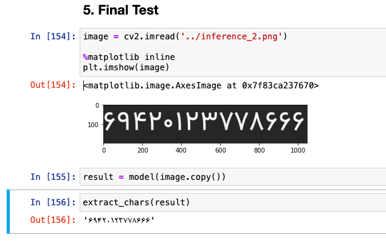
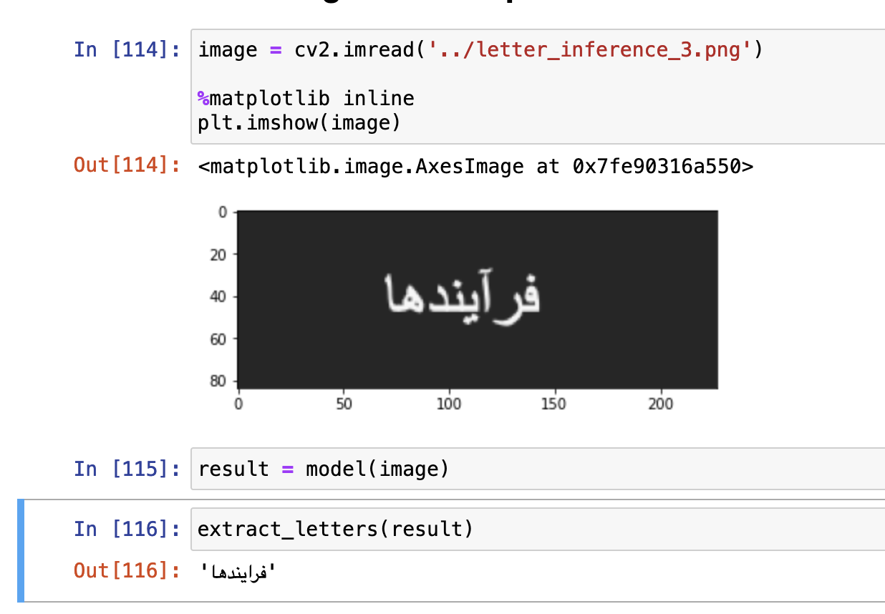

# Persian OCR Project

This repository is my biggest [FLOSS](https://en.wikipedia.org/wiki/Free_and_open-source_software) project. I had it in my mind since the last year, when I was working on an _automatic license plate number recognition_ project. So what I was thinking of was this _a big FLOSS project_ and then, the idea of an OCR project came to my mind as well. 

Now I started working on the whole idea and this repository will be updated for every phase of the project.

## Important Notes

- This project is published under _GNU GPL version 3.0_ license. I assure everyone who's concerned that as long as I, _Muhammadreza Haghiri_ am in charge of this project the license will remain the same.
- If some parties decide to acquire this project and want a change in license, I'll try to negotiate to keep it Free (as in freedom).
- In the `.gitignore` file, we've ignored image files. It doesn't mean that our dataset won't be free. It will get so large so we've decided to ignore them in this repository, but we'll let you download data (raw or labeled) in near future.

## Project Technical Details

- Programming Language: Python 3 (3.9 on local machine, remote machines depend on where we do our tasks)
- AI library: PyTorch
- Model: [YOLOv5](https://github.com/ultralytics/yolov5)

## Models and Datasets

### Models for June 23rd 2022

* [Letters](https://persianocr.cam/models/letters.pt)
* [Numbers](https://persianocr.cam/models/numbers.pt)

## Results

### Number recognition

- From the input data:

    

- Screenshot from telegram:

    

- Final tests

    

## Letter recognition

## Project Phases

This part has been divided to two. First part is mostly considered _lab phase_ since we're working as a group of data scientists and AI enthusiasts to develop and deploy our model and the second part is also considered as _business/product phase_ and we try to present the result as a product to the outside world. 

### Lab phases

- Number recognition
    - [x] Data generation using [Zarnevis](https://github.com/prp-e/zarnevis).
    - [x] Training YOLOv5 on generated data.
    - Testing the result.
        - [x] Test on different numbers written on the same fonts.
        - [x] Test on same or different numbers written in different fonts.
        - [x] Test on hand-written numbers to find out how accurate our model is.
    - [ ] Asking participants to write down some random numbers (Data generation for hand-written numbers)
    - [ ] Training YOLOv5 on both hand-written and digital numbers.
    - Final Tests
        - [ ] Test on different numbers, both hand-written and digital.
- Letter recognition
    - [x] Data generation using [Zarnevis](https://github.com/prp-e/zarnevis).
        - Instead of generating our own data, data gathered from [Shotor](https://github.com/amirabbasasadi/Shotor).
    - [x] Training YOLOv5 on generated data.
    - Testing the results.
        - [x] Test on different words with the same font.
        - [x] Test on the same or different words written in different fonts.
    - [ ] Gathering hand-written words data.
    - [ ] Final tests.
- Word detection
    - [ ] Training the YOLOv5 model on how to detect words in a sentence.
- Jupyter notebook for people who want to test the model. 

### Business/Product phases

- Designing a web service for production.